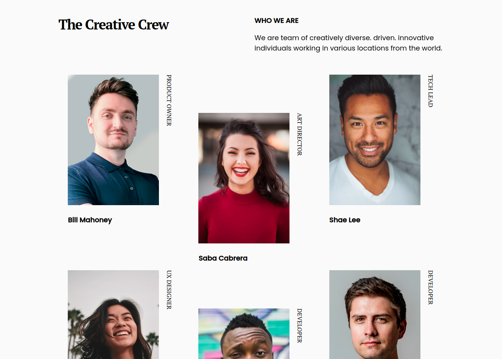

<!-- Please update value in the {}  -->

<h1 align="center">Dev Challenge - My Team PAGE</h1>

   Solution for a challenge from  <a href="http://devchallenges.io" target="_blank">Devchallenges.io</a>.

  <h3>
    <a href="https://competent-hodgkin-5896ee.netlify.app/">
      Demo
    </a>
     | 
    <a href="https://github.com/hare451g/dc-my-team">
      Solution
    </a>
     | 
    <a href="https://devchallenges.io/challenges/hhmesazsqgKXrTkYkt0U">
      Challenge
    </a>
  </h3>

<!-- TABLE OF CONTENTS -->

## Table of Contents

- [Overview](#overview)
  - [Built With](#built-with)
- [Features](#features)
- [Contact](#contact)
- [Acknowledgements](#acknowledgements)

<!-- OVERVIEW -->

## Overview

Introduce your projects by taking a screenshot or a gif. Try to tell visitors a story about your project by answering:

- Where can I see your demo?
  You can see demo at [this netlify link](https://angry-roentgen-e675b2.netlify.app/)
- What was your experience?
  I'm software engineer with 4 years of experience and 2 years experiences as front-end engineer
- What have you learned/improved?
  I just refreshed my knowledge about pure html + css website, and i just improved my flex box understanding
- Your wisdom? :)
  Maybe you should take time to re-learn your basic skills, it's fun and worth the efforts and time.

### Built With

<!-- This section should list any major frameworks that you built your project using. Here are a few examples.-->

- HTML
- CSS

## Features

<!-- List the features of your application or follow the template. Don't share the figma file here :) -->

This application/site was created as a submission to a [DevChallenges](https://devchallenges.io/challenges) challenge. The [challenge](https://devchallenges.io/challenges/hhmesazsqgKXrTkYkt0U) was to build an application to complete the given user stories.

## Acknowledgements

<!-- This section should list any articles or add-ons/plugins that helps you to complete the project. This is optional but it will help you in the future. For exmpale -->

- [Steps to replicate a design with only HTML and CSS](https://devchallenges-blogs.web.app/how-to-replicate-design/)
- [Handle nth-child](https://www.w3schools.com/cssref/sel_nth-child.asp)
- [Media Query](https://www.w3schools.com/css/css_rwd_mediaqueries.asp)
- [Flexbox](https://www.w3schools.com/css/css3_flexbox.asp)

## Contact

- Website [hendrasadewa.site](https://hendrasadewa.site)
- GitHub [@hare451g](https://github.com/hare451g)
- Twitter [@sadevva\_](https://twitter.com/@sadevva_)
